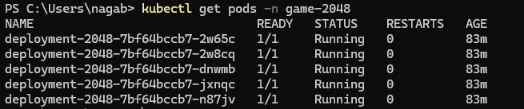
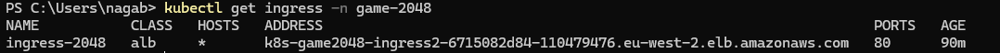
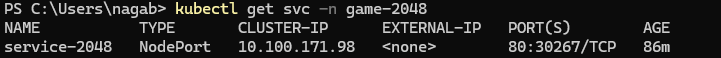
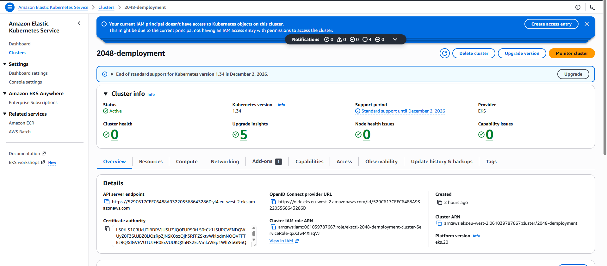
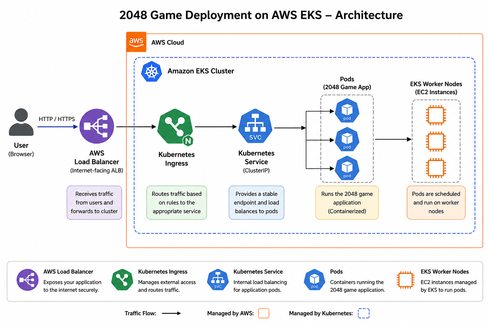

# 🚀 2048 Game Deployment on AWS EKS

## 📌 Overview

This project demonstrates deploying the 2048 game on **Amazon EKS (Kubernetes)**.

I implemented the deployment by creating an EKS cluster, deploying the application using Kubernetes manifests, and exposing it via a LoadBalancer/Ingress.

---

## 🛠️ Tech Stack

* AWS EKS
* Kubernetes
* kubectl
* AWS Load Balancer Controller

---

## ⚙️ What I Did

* Created an EKS cluster
* Configured kubectl access
* Deployed the 2048 game using Kubernetes YAML
* Exposed the application using LoadBalancer/Ingress
* Verified pods, services, and nodes

---

## 📸 Screenshots

### 🎮 Application Running


---

### ☸️ Kubernetes Pods



---

### 🌐 Services / Ingress




---

### ☁️ AWS EKS Cluster



---

## 🧠 Architecture

User → Load Balancer → Kubernetes Service → Pods → EKS Nodes



---

## 📜 Commands Used

```bash
eksctl create cluster --name 2048-demployment

kubectl apply -f deployment.yaml
kubectl apply -f service.yaml

kubectl get pods
kubectl get svc
kubectl get nodes
```

---

## ⚠️ Note

The Load Balancer URL is not available because the EKS cluster was deleted after testing to avoid AWS costs.

---

## 🔗 Reference

This project was implemented based on a learning resource:
https://github.com/iam-veeramalla/aws-devops-zero-to-hero

---

## 🚀 Learning Outcome

* Hands-on experience with EKS
* Kubernetes deployment & services
* AWS networking & load balancing
* Real-world DevOps workflow

---
